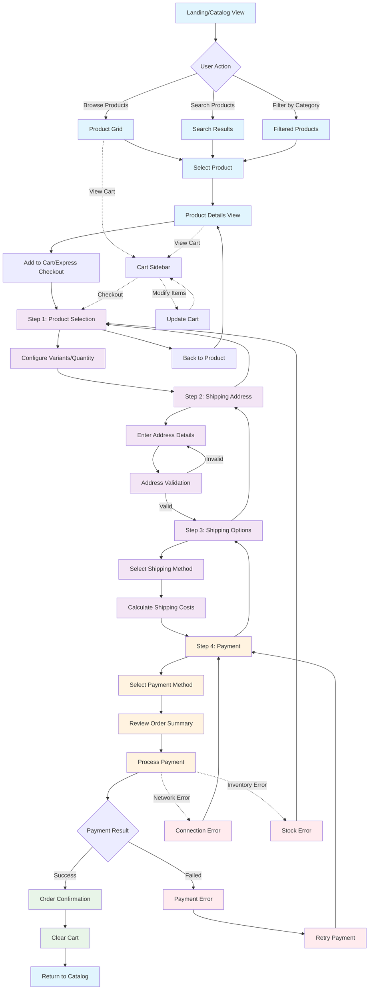

# OAG Express Marketplace

A complete, self-contained **embeddable React marketplace component** powered by MedusaJS. Perfect for SaaS platforms and partner integrations that need a full e-commerce experience without managing any marketplace state.

## Features

### Complete Marketplace Experience
- **Product Catalog** - Browse products with categories, search, and pagination
- **Express Checkout** - Streamlined 4-step checkout process
- **Cart Management** - Persistent cart across sessions
- **Order Processing** - Complete order management with payment integration
- **Responsive Design** - Mobile-friendly with TailwindCSS

### Self-Contained & Embeddable
- **Zero State Management** - Embedding app manages no marketplace state
- **Plug-and-Play** - Just provide backend credentials and embed
- **Custom Routing** - Works within any React app without conflicts
- **TypeScript Support** - Full type safety and IntelliSense

### MedusaJS Integration
- **Product Discovery** - Automatic product and category fetching
- **Real-time Pricing** - Dynamic pricing with region support
- **Inventory Management** - Live inventory tracking
- **Payment Processing** - Multiple payment provider support
- **Shipping Calculation** - Dynamic shipping options and rates

## Installation

### From Private Git Repository

```bash
npm install git+https://github.com/mrsubtle/oag-express-marketplace.git
# or
yarn add git+https://github.com/mrsubtle/oag-express-marketplace.git
```

### Peer Dependencies

Ensure your project has these React versions:

```bash
npm install react@^18.0.0 react-dom@^18.0.0
```

## Quick Start

### Basic Implementation (Recommended)

```typescript
import { OAGExpressMarketplace } from "@oag/oag-express-marketplace";

function MyApp() {
  return (
    <OAGExpressMarketplace
      backendUrl="https://your-medusa-backend.com"
      publishableKey="pk_your_medusa_publishable_key"
    />
  );
}
```

**That's it!** The component handles everything:
- Product catalog with search and categories
- Shopping cart management
- Complete checkout flow
- Order processing

### Advanced Implementation

```typescript
import { OAGExpressMarketplace } from "@oag/oag-express-marketplace";

function MyApp() {
  return (
    <OAGExpressMarketplace
      backendUrl={process.env.NEXT_PUBLIC_MEDUSA_BACKEND_URL}
      publishableKey={process.env.NEXT_PUBLIC_MEDUSA_PUBLISHABLE_KEY}
      title="Agricultural Equipment Store"
      catalogOptions={{
        searchPlaceholder: "Search agricultural equipment...",
        showCategories: true,
        showSearch: true,
        productsPerPage: 16
      }}
      onOrderComplete={(order) => {
        // Custom order handling
        console.log("Order completed:", order.id);
        // Send analytics, show notifications, etc.
      }}
      headerContent={
        <div className="text-center">
          
          <h1 className="text-2xl font-bold">My Equipment Store</h1>
        </div>
      }
    />
  );
}
```

## Configuration Options

### Required Props

| Prop | Type | Description |
|------|------|-------------|
| `backendUrl` | `string` | Your MedusaJS backend URL |
| `publishableKey` | `string` | Your MedusaJS publishable API key |

### Optional Props

| Prop | Type | Default | Description |
|------|------|---------|-------------|
| `className` | `string` | - | Custom CSS classes for styling |
| `title` | `string` | `"OpticAg Marketplace"` | Marketplace title |
| `initialView` | `"catalog" \| "product"` | `"catalog"` | Starting view mode |
| `productHandle` | `string` | - | Specific product to show (if `initialView="product"`) |
| `onOrderComplete` | `(order) => void` | - | Callback when order is completed |
| `headerContent` | `ReactNode` | - | Custom header content |
| `catalogOptions` | `object` | - | Catalog customization options |

### Catalog Options

```typescript
catalogOptions: {
  searchPlaceholder?: string;     // Search input placeholder
  showSearch?: boolean;           // Show/hide search bar (default: true)
  showCategories?: boolean;       // Show/hide category filters (default: true)
  productsPerPage?: number;       // Products per page (default: 12)
}
```

## Architecture

### UX Flow Diagram



### Component Hierarchy

```
OAGExpressMarketplace
├── Layout (with RegionProvider & CartProvider)
└── Marketplace
    ├── ProductCatalog (catalog view)
    │   ├── Search functionality
    │   ├── Category navigation
    │   └── Product grid with pagination
    └── ExpressCheckout (product view)
        ├── ProductSelection
        ├── AddressForm
        ├── ShippingOptions
        └── Payment
```

### URL Routing

The component uses URL parameters for internal navigation:

- **Catalog View**: `/your-page` or `/your-page?view=catalog`
- **Product View**: `/your-page/product-handle?view=product`
- **Checkout Steps**: `/your-page/product-handle?step=address|shipping|payment`

### State Management

- **Region Management**: Automatic region detection and currency handling
- **Cart Management**: Persistent cart across browser sessions
- **Product Data**: Cached product and category information
- **Checkout Flow**: Validation and progress tracking

## Styling & Customization

### TailwindCSS Integration

The component uses TailwindCSS with MedusaJS UI preset. Add to your `tailwind.config.js`:

```javascript
module.exports = {
  content: [
    "./src/**/*.{js,ts,jsx,tsx}",
    "./node_modules/@oag/oag-express-marketplace/dist/**/*.{js,ts,jsx,tsx}"
  ],
  presets: [require("@medusajs/ui-preset")],
  // ... your config
};
```

### Custom Styling

```typescript
<OAGExpressMarketplace
  className="my-custom-marketplace"
  // ... other props
/>
```

```css
.my-custom-marketplace {
  --marketplace-primary: #your-color;
  /* Custom CSS variables */
}
```

## Advanced Usage

### Individual Components

For custom implementations, you can use individual components:

```typescript
import {
  ProductCatalog,
  ExpressCheckout,
  RegionProvider,
  CartProvider
} from "@oag/oag-express-marketplace";

function CustomImplementation() {
  return (
    <RegionProvider>
      <CartProvider>
        <div className="my-layout">
          <ProductCatalog onProductSelect={handleProductSelect} />
          {/* OR */}
          <ExpressCheckout productHandle="my-product" />
        </div>
      </CartProvider>
    </RegionProvider>
  );
}
```

### Navigation Utilities

```typescript
import {
  navigateToProduct,
  navigateToCatalog,
  getMarketplaceView
} from "@oag/oag-express-marketplace";

// Programmatic navigation
navigateToProduct("product-handle");
navigateToCatalog();

// Check current view
const currentView = getMarketplaceView(); // "catalog" | "product"
```

## Environment Setup

### Environment Variables

```bash
# Required for your MedusaJS backend
NEXT_PUBLIC_MEDUSA_BACKEND_URL=https://your-medusa-backend.com
NEXT_PUBLIC_MEDUSA_PUBLISHABLE_KEY=pk_your_publishable_key
```

### MedusaJS Backend Requirements

Your MedusaJS backend should have:
- Products with variants and pricing
- Regions and currencies configured
- Payment providers enabled
- Shipping options configured
- CORS configured for your domain

## Responsive Design

The component is fully responsive with breakpoints:
- **Mobile**: Single column layout
- **Tablet**: Adaptive grid layouts
- **Desktop**: Full two-column layout with sidebar

## Error Handling

Built-in error handling for:
- Network connectivity issues
- Invalid product handles
- Payment processing errors
- Shipping calculation failures
- Backend API errors

## Testing

```bash
# Run the build process
npm run build

# Test in development mode
npm run dev
```

## Requirements

- **OAG Marketplace Partner Key**
- **OAG Marketplace URL**
- **React**: ^18.0.0
- **TailwindCSS**: ^3.0+ (with MedusaJS UI preset)
- **TypeScript**: ^5.0+ (recommended)

## Integration Examples

### NextJS Integration

```typescript
// pages/marketplace.tsx
import { OAGExpressMarketplace } from "@oag/oag-express-marketplace";

export default function MarketplacePage() {
  return (
    <div className="container mx-auto">
      <OAGExpressMarketplace
        backendUrl={process.env.NEXT_PUBLIC_MEDUSA_BACKEND_URL}
        publishableKey={process.env.NEXT_PUBLIC_MEDUSA_PUBLISHABLE_KEY}
      />
    </div>
  );
}
```

### React Router Integration

```typescript
// App.tsx
import { BrowserRouter, Route, Routes } from 'react-router-dom';
import { OAGExpressMarketplace } from "@oag/oag-express-marketplace";

function App() {
  return (
    <BrowserRouter>
      <Routes>
        <Route path="/marketplace/*" element={
          <OAGExpressMarketplace
            backendUrl={process.env.REACT_APP_MEDUSA_BACKEND_URL}
            publishableKey={process.env.REACT_APP_MEDUSA_PUBLISHABLE_KEY}
          />
        } />
      </Routes>
    </BrowserRouter>
  );
}
```

### Vite Integration

```typescript
// main.tsx
import { OAGExpressMarketplace } from "@oag/oag-express-marketplace";

function App() {
  return (
    <OAGExpressMarketplace
      backendUrl={import.meta.env.VITE_MEDUSA_BACKEND_URL}
      publishableKey={import.meta.env.VITE_MEDUSA_PUBLISHABLE_KEY}
    />
  );
}
```

## Contributing

Contact the OpticAg team with your wish list.

## License

UNLICENSED - Private project

## Support

For support and questions:
- Create an issue in the repository
- Contact the development team
- Check MedusaJS documentation for backend configuration

---

**Built with ❤️ for the OpticAg Partner Network**
